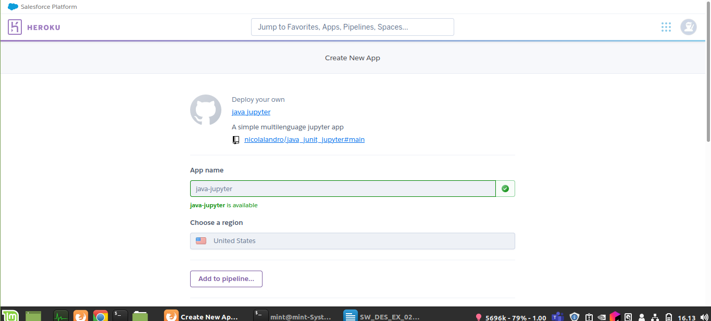
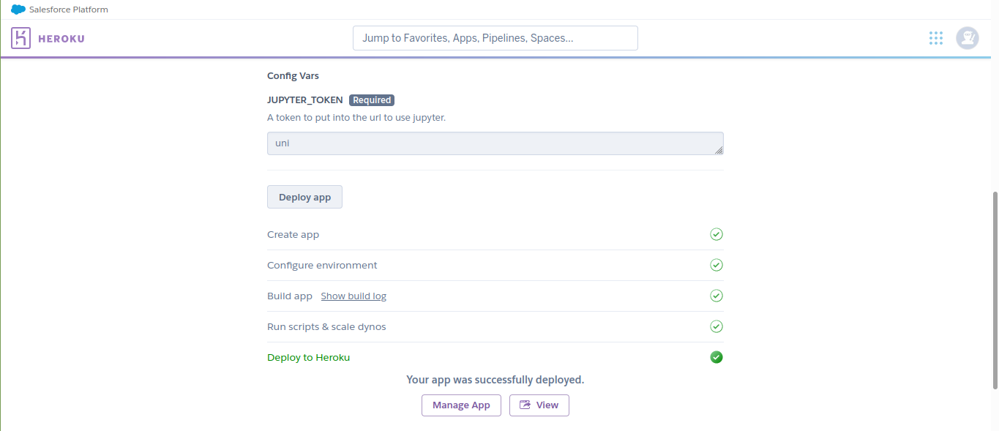
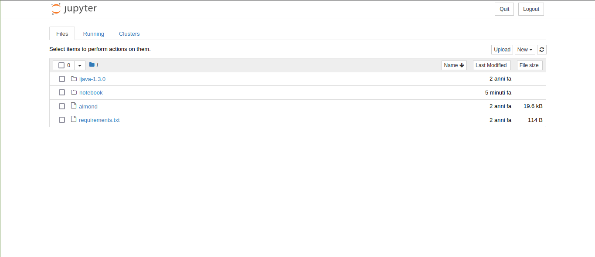
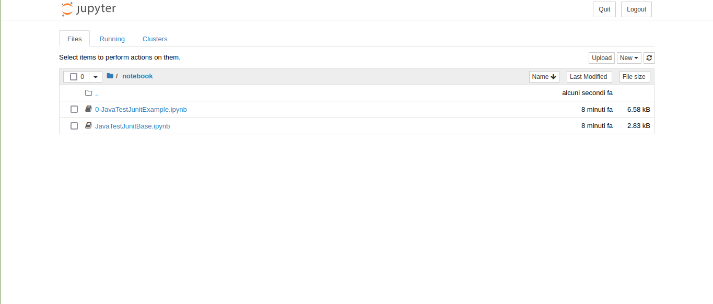
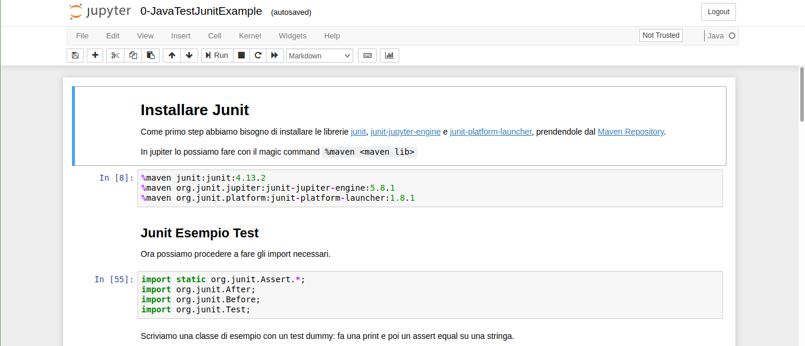

# Java Junit Jupyter
This repo is able to deploy a jupyter that support multiple lenguages and it contains some notebooks about junit testing.

# Deploy Guide

* login to [heroku.com](https://heroku.com/)
* click the Deploy Button 
* select your favourit app name

* select your password for jupyter

* wait some minutes... and click view button: you are on jupyter!

* Add your password and you are in

* You can see the example notebooks into the folder `notebooks`

* You can open one end use it.

